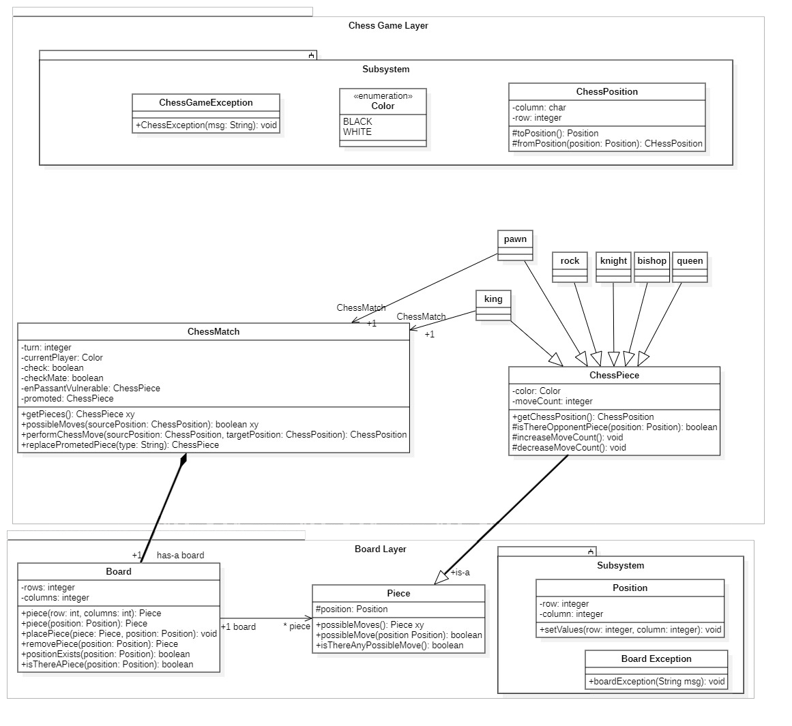

# Chess-Game-JAVA

A console chess game implemented using Java.

## UML Sketch:

## To be done:

- [ ] Add all classes and methods as displayed in the UML
- [ ] Add initialSetup method to the UML sketch
