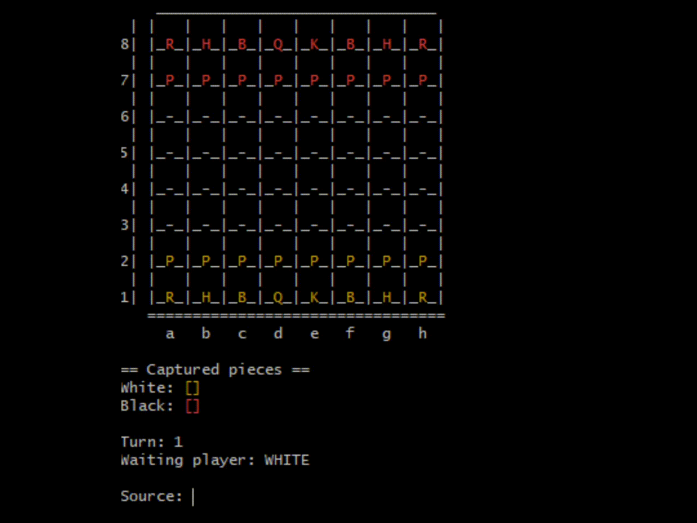

# Chess-Game-JAVA

A console chess game implemented using Java as part of the
Nelio Alves Complete Java course. The game features a
complete set of chess pieces and the ability to play a full
game of chess through the console.

## Sample:

## Features:

- [x] All pieces functioning;
- [x] Castlings, en passant and promotion moves implemented;
- [x] Console colors;
- [x] All UML sketches displayed in README.md.

## UML Sketch:

### Initial Basic UML

### In depth final UMLS per package

* UMLs generated by Enterprise Architect Software

--- 

